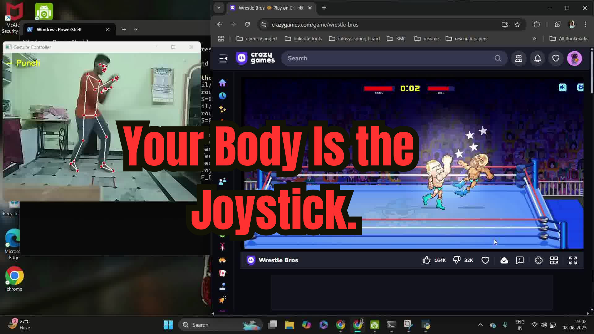

# 🕹️ Real-Time Gesture Controller Using MediaPipe & OpenCV

This project uses **MediaPipe** and **OpenCV** to recognize real-time body movements and convert them into keyboard actions like jumping, moving, and punching.

## 🎯 Features
- Punch detection (mapped to Space bar)
- Jump, duck, move left/right (mapped to arrow keys)
- Real-time webcam input
- No external hardware required

## 🔧 Technologies
- Python
- MediaPipe
- OpenCV
- PyAutoGUI

## 📽️ Demo
[](https://github.com/MakamDevansh044/wrestle-bros/blob/main/wrestle%20bros%20(%20demo%20play).mp4)

## 🚀 Getting Started

```bash
pip install -r requirements.txt
python main.py

## 📬 Contact
Made with ❤️ by **Makam Devansh**
